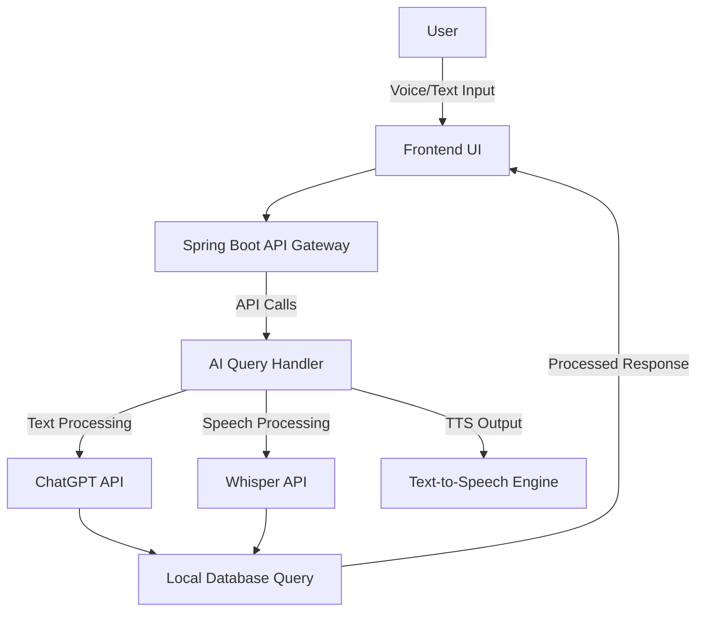

# BharatGPT
# 🇮🇳 BharatGPT – AI for Everyday India

> Scalable, Secure, and Smart Multilingual AI for Bharat

**BharatGPT** is an open, multilingual, AI-powered assistant designed to serve the everyday needs of Indians—from rural farmers to urban students—via voice and text interfaces. With a layered microservices architecture, real-time data APIs, local offline databases, and OpenAI models at its core, BharatGPT bridges the digital divide.

---

## 🔥 Key Features

- 🗣️ **Multilingual Voice & Text Input** (English, Hindi, Telugu, etc.)
- 🧠 **AI-Powered Q&A** using fine-tuned ChatGPT models
- 🌐 **Local Knowledge Access** (shops, govt. schemes, FAQs)
- 🚆 **Real-time Updates** for news, transport, and weather
- 🔒 **End-to-End Security** (AES encryption, JWT, OAuth2)
- 📶 **Offline Mode** using local SQLite/Firestore databases
- ⚙️ **Modular Microservices Architecture** for scalability

---

## ⚙️ Tech Stack

| Layer                | Technologies Used |
|---------------------|-------------------|
| **Frontend**        | React + Tailwind (Web), Flutter / React Native (Mobile), Voice UI |
| **API Gateway**     | Spring Cloud Gateway |
| **Backend**         | Spring Boot Microservices |
| **AI Services**     | ChatGPT (OpenAI), Whisper (STT), gTTS / TTS Engine |
| **Database**        | MySQL, SQLite (offline), Firestore (cloud) |
| **Caching**         | Redis / Memcached |
| **Security**        | AES-256 Encryption, JWT, OAuth2 |
| **Deployment**      | Docker, Kubernetes (optional), Edge Devices |

---

## 🏗️ Architecture Overview

### 🔷 **Layered System Architecture**

1. **User Interaction Layer**
   - 🖥️ Web App (React + Tailwind)
   - 📲 Mobile App (Flutter / React Native)
   - 🎙️ Voice Assistant (Voice/Text Input)

2. **API Gateway & Microservices**
   - 🚦 API Gateway (Spring Cloud)
   - 🔹 User Query Service
   - 🔹 AI Response Service (ChatGPT)
   - 🔹 Speech Processing Service (Whisper + TTS)
   - 🔹 Local Info Fetcher (Firestore, SQLite)

3. **Data Storage & Intelligence**
   - 📂 Local DB: SQLite / MySQL (shops, schemes, FAQs)
   - 🔍 Live APIs: transport, news, weather
   - ⚡ Cache Layer: Redis/Memcached for fast response

4. **Security Layer**
   - 🔐 AES-256 Encryption
   - 🔑 JWT Authentication
   - 🛡️ OAuth2 + Role-Based Access Control

---

### 🔄 **Mermaid Data Flow Diagram**

## 💡Key Innovations
### Innovation	Description
🔀 Hybrid AI -->Combines AI + rule-based models for structured replies

📶 Offline Mode -->Pre-cached DB for rural areas with low connectivity

🧩 Modular Design -->Plug-and-play microservices for flexible scaling

🔄 Live Feeds -->Integrated APIs for dynamic updates

🌍 Edge Computing	 -->Processes speech locally for fast, offline use

## 🚀 Getting Started
### 1️⃣ Clone the Repository
git clone https://github.com/yourusername/BharatGPT.git
cd BharatGPT

### 2️⃣ Backend Setup (Spring Boot)
cd backend
./mvnw spring-boot:run

### 3️⃣ Frontend Setup (React)
cd frontend
npm install
npm start

### 4️⃣ Mobile App (Flutter/React Native)
Refer to the /mobile/README.md for native app instructions.

## 🧪 Example Use Cases
👨‍🌾 Farmer queries about govt. subsidy schemes via voice
🧕 Rural woman using the app in Hindi to find nearest health center
🧑‍🎓 Student checks exam results and weather with text in Telugu

## 🛡️ Security
- AES-256 for encrypting user data
- JWT tokens for secure sessions
- OAuth2 + Role-Based Access Control for user permissions
- API throttling and request validation

## 📂 Folder Structure

BharatGPT/
├── backend/ # Spring Boot Microservices

├── frontend/ # React Web UI

├── mobile/ # Flutter or React Native apps

├── local-db/ # SQLite and MySQL scripts

├── scripts/ # Shell scripts for setup

└── README.md # Project Overview

## 🤝 Contributing
- Pull requests are welcome! To contribute:
- Fork the repo
- Create a branch (feature/YourFeature)
- Commit changes
- Push and open a PR

### 📄 License
This project is licensed under the MIT License. See the LICENSE file for details.

### 🌟 Acknowledgements
🔹OpenAI (ChatGPT & Whisper)
🔹Spring Boot Contributors
🔹Government of India Open Data APIs
🔹Inspired by the vision of Digital Bharat

### 🔗 Connect
Project Lead – Anvesh Durgam
LinkedIn
📬 Feel free to raise issues or suggest enhancements!
